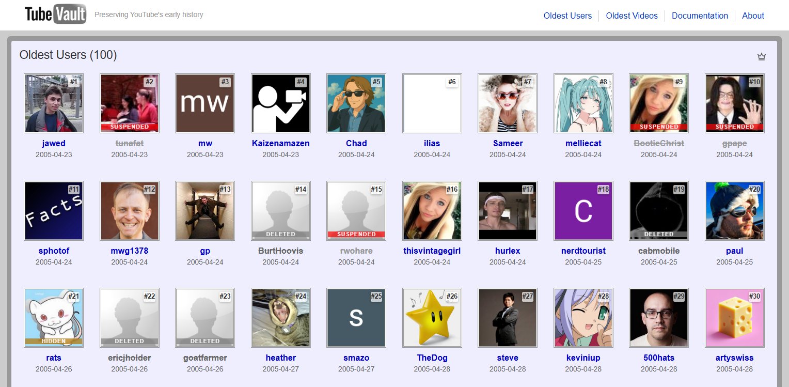

# TubeVault

An archive of YouTube's oldest users and videos from 2005. All rankings are validated via incremental IDs - see [this article](https://tubevault.org/t/incremental_ids) for technical details.

🌐 **Check out the website**: [tubevault.org](https://tubevault.org)




## Installation

```bash
# Install dependencies
npm install

# Build for production
npm run build

# Update data archives (requires YOUTUBE_API_KEY env variable)
cd scripts/update-users && cargo run

# Run the site locally
npm run preview
```

## Development

```bash
# Install dependencies
npm install

# Start development server
npm run dev
```

## Data Sources

- **users.json**: List of oldest YouTube accounts. Automated data refresh via GitHub Actions every 3 days.
- **videos.json**: List of oldest YouTube videos
- **videos-archive/**: Preserved video files in original quality

## Contributing

We're currently looking for contributions for new articles. See [CONTRIBUTIONS.md](CONTRIBUTIONS.md) for guidelines on how to contribute articles to TubeVault.

## Disclaimer

This site is not affiliated with Google, YouTube, or any of their subsidiaries. TubeVault is an independent preservation project for historical documentation purposes.